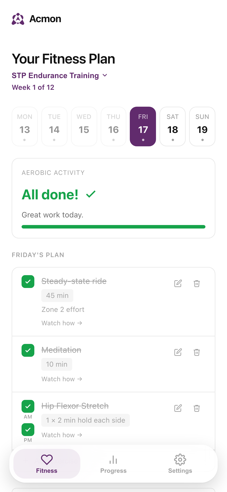
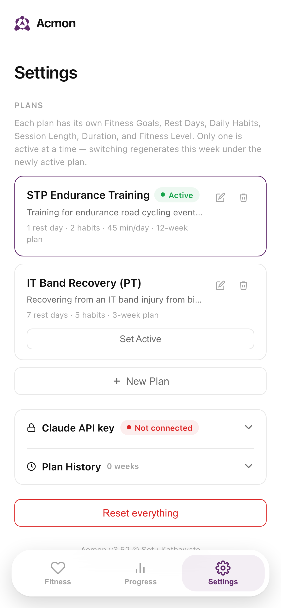
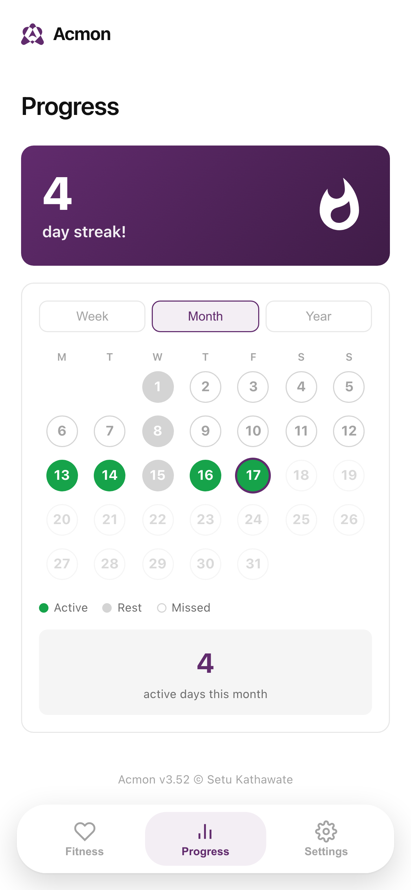

# Acmon

A self-hosted fitness planner that actually adapts to what you tell it — not a generic template. Describe your goals in your own words, and Claude turns that into a real weekly schedule: which days you train, what you train, how long each session runs.

## Screenshots

<table>
<tr>
<td></td>
<td></td>
<td></td>
</tr>
</table>

## What it does

- **Describe your goals, get a real plan.** Tell it what you're training for — an injury you're working around, an event you're training toward, a bike fitter's specific advice — and Claude generates a week that actually reflects it, not a generic template.
- **Multiple plans, one app.** Keep separate plans for separate goals (marathon training, a PT rehab protocol, general fitness) and switch which one's active without losing the others' history.
- **What you configure is guaranteed, not just requested.** Rest days, daily habits (meditation, stretches — including twice-a-day items), and session length are enforced in code, not left to hope the AI remembers. If the AI is unavailable, the app still respects every one of them.
- **Works without AI.** No API key configured, or the AI request fails? You still get a sensible, structured weekly plan — just without the personalization.
- **Progress tracking.** Streaks, a completion calendar, and full history per plan.
- **Installable PWA.** Add it to your home screen on iOS or Android; it behaves like a native app.

## How it's built

- **Backend**: Flask + SQLite, a single small key-value store synced from the browser — no accounts, no ORM.
- **Frontend**: one HTML file, vanilla JS and CSS. No framework, no build step, no bundler.
- **AI**: calls the Claude API directly from the browser with your own API key — nothing proxied through a server, nothing stored off-device.
- **Deployment**: a single Docker container (see `docker-compose.yml`), designed to run on a home server or NAS behind your own reverse proxy / access control.

## Running it yourself

```bash
docker compose up -d --build
```

This is built for personal, single-user self-hosting — there's no login system, so anyone who can reach the app shares one account. Put it behind your own access control (a reverse proxy with auth, a VPN, Cloudflare Access, etc.) if it's reachable from outside your network.

The AI features need a [Claude API key](https://console.anthropic.com/) — added from within the app (Settings → Claude API key), stored only in your own database, never sent anywhere except Anthropic's API.
